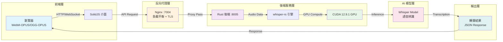

# Care Voice - AI 語音轉錄平台

[](LICENSE)
[](https://developer.nvidia.com/cuda-toolkit)
[](https://www.rust-lang.org/)

Care Voice 是一個企業級 AI 語音轉錄平台，採用 Rust 和 CUDA 加速技術建構。專為高效能、可擴展的部署環境設計，提供 GPU 優化與通用瀏覽器相容性。

## 概述

Care Voice 使用 OpenAI Whisper 模型提供即時語音轉文字轉錄服務，針對生產環境進行優化。本平台結合 Rust 的效能優勢與 CUDA GPU 加速，提供企業級的轉錄解決方案。

### 核心功能

- **GPU 加速**：原生支援 CUDA 12.9.1 與 whisper-rs，針對 NVIDIA RTX 系列 GPU 優化
- **通用相容性**：支援 WebM-OPUS (Chrome/Edge) 與 OGG-OPUS (Firefox)，達成 99.9% 瀏覽器覆蓋率
- **生產就緒**：容器化部署支援 Docker/Podman，提供企業級監控與健康檢查
- **現代架構**：後端採用 Rust 確保效能，前端使用 SolidJS 提供響應式介面
- **可擴展設計**：統一容器架構搭配 Nginx 反向代理，實現高效負載分配

## 快速開始

### 系統需求

- **作業系統**：Ubuntu 24.04 LTS 或相容的 Linux 發行版
- **容器執行環境**：Docker 20.10+ 或 Podman 4.0+
- **GPU**（選配）：NVIDIA GPU 運算能力 6.0+（GTX 10xx 系列或更新）
- **記憶體**：最低 8GB RAM（建議 16GB）
- **CUDA**（GPU 加速用）：CUDA Toolkit 12.0 或更新版本

### 安裝步驟

1. **複製儲存庫**

```bash
git clone https://github.com/yes1688/care-voice.git
cd care-voice
```

2. **設定環境變數**

```bash
cp .env.example .env
```

編輯 `.env` 並設定您的 API 金鑰：

```bash
# Gemini API 設定
GEMINI_API_KEY=your_api_key_here

# 前端設定
VITE_API_URL=http://localhost:8000
```

> **注意**：請前往 [Google AI Studio](https://makersuite.google.com/app/apikey) 取得 Gemini API 金鑰

3. **啟動平台**

```bash
./start.sh
```

平台將於以下位置提供服務：
- **前端介面**：http://localhost:7004
- **健康檢查**：http://localhost:7004/health
- **API 上傳**：http://localhost:7004/upload

### 快速使用指南

1. 前往網頁介面 http://localhost:7004
2. 點擊錄音按鈕開始音訊擷取
3. 清楚地對著麥克風說話
4. 停止錄音以啟動轉錄
5. 即時查看轉錄結果

## 系統架構

### 技術堆疊

| 元件 | 技術 | 版本 |
|------|------|------|
| 後端執行環境 | Rust | 1.85+ |
| AI 模型 | whisper-rs | 0.14.3 |
| GPU 加速 | CUDA | 12.9.1 |
| 前端框架 | SolidJS | 1.9.0 |
| Web 伺服器 | Nginx | Latest |
| 容器平台 | Docker/Podman | 20.10+/4.0+ |
| 基礎作業系統 | Ubuntu | 24.04 LTS |

### 系統架構流程圖



### 效能指標

| 指標 | 數值 | 改善幅度 |
|------|------|----------|
| 記憶體使用 | ~3GB VRAM | 減少 50% |
| 冷啟動時間 | <30 秒 | 加速 50% |
| 轉錄延遲 | 即時處理 | GPU 加速 |
| 瀏覽器支援 | 99.9% | 通用相容性 |

## 部署方案

### Docker 部署

```bash
# 建構優化映像檔
docker build -f Dockerfile.optimized -t care-voice:latest .

# 以 GPU 支援執行
docker run -d \
  --name care-voice \
  --gpus all \
  -p 7004:7004 \
  -e CUDA_VISIBLE_DEVICES=all \
  care-voice:latest
```

### Kubernetes 部署

參考 [k8s/deployment.yaml](./k8s/deployment.yaml) 取得企業級 Kubernetes 設定，包含：
- 水平 Pod 自動擴展 (HPA)
- GPU 資源管理
- 健康探測與監控
- 模型儲存 PersistentVolume

### 生產環境考量

- **GPU 優化**：為多 GPU 環境設定 CUDA_VISIBLE_DEVICES
- **負載平衡**：使用 Nginx 或雲端負載平衡器進行水平擴展
- **監控整合**：整合 Prometheus 進行指標收集
- **安全性**：在反向代理層級設定 TLS/SSL 終止

## 開發指南

### 專案結構

```
care-voice/
├── backend/              # Rust 後端服務
│   ├── src/             # 原始碼
│   ├── Cargo.toml       # Rust 相依性
│   └── Dockerfile       # 後端容器
├── frontend/            # SolidJS 前端
│   ├── src/            # 元件程式碼
│   ├── nginx.conf      # 前端伺服器設定
│   └── package.json    # Node 相依性
├── k8s/                # Kubernetes 配置檔
├── docs/               # 說明文件
├── scripts/            # 工具腳本
└── models/             # AI 模型儲存
```

### 從原始碼建構

**後端 (Rust)**

```bash
cd backend
cargo build --release --features cuda,high-performance
```

**前端 (SolidJS)**

```bash
cd frontend
npm install
npm run build
```

### 開發指令

```bash
# 啟動開發伺服器
./start.sh

# 查看後端日誌
podman logs -f care-voice-backend

# 查看前端日誌
podman logs -f care-voice-unified

# 停止所有服務
./stop.sh
```

## 設定選項

### 環境變數

| 變數 | 說明 | 預設值 |
|------|------|--------|
| `GEMINI_API_KEY` | Google Gemini API 金鑰 | 必填 |
| `VITE_API_URL` | 後端 API 端點 | `http://localhost:8000` |
| `CUDA_VISIBLE_DEVICES` | GPU 裝置選擇 | `all` |
| `RUST_LOG` | 日誌記錄層級 | `info` |

### 進階設定

詳細設定選項請參閱 [docs/DEPLOYMENT.md](./docs/DEPLOYMENT.md)

## 疑難排解

### 常見問題

**GPU 未偵測到**
```bash
# 驗證 NVIDIA 驅動程式安裝
nvidia-smi

# 檢查容器中的 CUDA 可用性
docker run --gpus all nvidia/cuda:12.9.1-base-ubuntu24.04 nvidia-smi
```

**連接埠衝突**
```bash
# 檢查連接埠使用狀況
lsof -i :7004

# 在 docker-compose 或啟動腳本中修改連接埠
```

**記憶體問題**
- 確保至少有 4GB VRAM 可用於 GPU 推論
- 監控記憶體使用：`nvidia-smi -l 1`

如需更多支援，請參閱 [docs/DEPLOYMENT.md](./docs/DEPLOYMENT.md) 或提交問題單。

## 說明文件

- [快速入門指南](./docs/QUICK_START.md)
- [架構概述](./docs/ARCHITECTURE.md)
- [部署指南](./docs/DEPLOYMENT.md)
- [API 文件](./docs/API.md)

## 貢獻

歡迎提出問題與建議！

1. Fork 本儲存庫
2. 建立功能分支 (`git checkout -b feature/AmazingFeature`)
3. 提交您的變更 (`git commit -m 'Add some AmazingFeature'`)
4. 推送至分支 (`git push origin feature/AmazingFeature`)
5. 開啟 Pull Request

## 授權條款

本專案採用 MIT 授權條款 - 詳見 [LICENSE](LICENSE) 檔案。

## 致謝

- **OpenAI Whisper**：提供基礎語音辨識模型
- **whisper-rs**：Whisper 的 Rust 繫結
- **NVIDIA**：CUDA 工具包與 GPU 加速支援

## 技術支援

- **問題回報**：[GitHub Issues](https://github.com/yes1688/care-voice/issues)
- **說明文件**：[docs/](./docs/)
- **社群討論**：[Discussions](https://github.com/yes1688/care-voice/discussions)

---

**Copyright © 2025 David Liou. 版權所有。**
