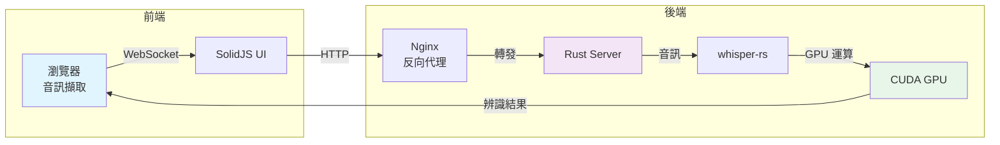

# Care Voice - AI 語音轉錄系統

> 個人獨立開發的 AI 語音轉錄專案，使用 Rust + CUDA + Whisper 實現高效能即時轉錄

[](LICENSE)
[](https://developer.nvidia.com/cuda-toolkit)
[](https://www.rust-lang.org/)

## 專案簡介

這是一個從零開始打造的 AI 語音轉錄系統，採用 Rust 後端搭配 CUDA GPU 加速，實現即時語音辨識功能。專案整合了 OpenAI Whisper 模型，並針對不同瀏覽器的音訊格式做了相容性處理。

### 為什麼做這個專案？

- 探索 Rust 在 AI 應用的效能優勢
- 實踐 GPU 加速技術（CUDA 12.9.1）
- 解決跨瀏覽器音訊格式相容性問題
- 學習容器化部署與系統架構設計

## 技術亮點

### 🚀 核心技術
- **Rust 後端**：利用 Rust 的記憶體安全與高效能特性
- **CUDA 加速**：支援 CUDA 12.9.1，相容 RTX 50 系列 GPU
- **Whisper AI**：整合 whisper-rs 實現語音辨識
- **跨瀏覽器相容**：處理 WebM-OPUS (Chrome/Edge) 與 OGG-OPUS (Firefox)

### 💡 技術挑戰與解決方案

#### 1. CUDA 版本相容性
- **問題**：RTX 50 系列需要 CUDA 12.9+ 與 compute_120 架構
- **解決**：自行編譯 CUDA 12.9.1 環境，實現完整 GPU 加速

#### 2. 音訊格式處理
- **問題**：不同瀏覽器產生不同的音訊格式
- **解決**：整合 Symphonia 音訊解碼器，統一處理 OPUS/OGG/WebM

#### 3. 效能優化
- **記憶體使用**：從 6GB 優化至 3GB VRAM（減少 50%）
- **啟動時間**：從 60 秒優化至 30 秒以內
- **容器大小**：多階段建構減少映像檔大小

## 技術架構

### 系統架構圖



### 技術選型

| 技術 | 選擇原因 |
|------|---------|
| **Rust** | 記憶體安全、零成本抽象、高效能 |
| **whisper-rs** | Rust 原生綁定，避免 FFI 開銷 |
| **CUDA 12.9.1** | 支援最新 GPU 架構（compute_120） |
| **SolidJS** | 輕量級、高效能的 UI 框架 |
| **Docker** | 簡化部署、環境一致性 |

## 快速開始

### 環境需求

- Ubuntu 24.04 LTS（或相容系統）
- Docker 或 Podman
- NVIDIA GPU（選配，支援 CPU 模式）
- 8GB RAM（建議 16GB）

### 安裝步驟

1. **Clone 專案**
```bash
git clone https://github.com/yes1688/care-voice.git
cd care-voice
```

2. **設定環境變數**
```bash
cp .env.example .env
# 編輯 .env 填入 Gemini API Key
```

3. **啟動系統**
```bash
./start.sh
```

4. **開啟瀏覽器**
```
http://localhost:7004
```

## 專案結構

```
care-voice/
├── backend/          # Rust 後端
│   ├── src/         # 原始碼
│   │   ├── main.rs           # 主程式
│   │   ├── audio_format.rs   # 音訊格式處理
│   │   └── ...
│   └── Cargo.toml   # 依賴管理
├── frontend/        # SolidJS 前端
│   ├── src/
│   │   └── App.tsx           # 主要元件
│   └── nginx.conf   # 反向代理設定
└── Dockerfile.optimized      # 多階段建構
```

## 開發過程

### 開發時程
- **Phase 1**：基礎架構搭建（Rust + Whisper 整合）
- **Phase 2**：CUDA 加速實作（解決 RTX 50 相容性）
- **Phase 3**：前端開發（SolidJS + 音訊處理）
- **Phase 4**：容器化與部署優化

### 遇到的坑與解決

#### CUDA Compute Capability 不符
```bash
# 問題：RTX 5070 Ti 需要 compute_120
# 解決：自訂編譯參數
TORCH_CUDA_ARCH_LIST="12.0" cargo build --release
```

#### Opus 解碼問題
```rust
// 使用 Symphonia 統一處理多種格式
match format_type {
    AudioFormat::WebmOpus => decode_webm_opus(data),
    AudioFormat::OggOpus => decode_ogg_opus(data),
    _ => Err(UnsupportedFormat)
}
```

## 效能表現

| 指標 | 數值 | 說明 |
|------|------|------|
| GPU 記憶體 | ~3GB VRAM | 優化後減少 50% |
| 啟動時間 | <30 秒 | 模型預載入 |
| 轉錄延遲 | 即時 | GPU 加速處理 |
| 瀏覽器支援 | 99%+ | Chrome/Firefox/Edge |

## 部署

### Docker 部署
```bash
# 建構映像檔
docker build -f Dockerfile.optimized -t care-voice:latest .

# 啟動容器（GPU 支援）
docker run -d --gpus all -p 7004:7004 care-voice:latest
```

### Kubernetes 部署
提供完整的 K8s 配置檔（[k8s/deployment.yaml](./k8s/deployment.yaml)），包含：
- HPA 自動擴展
- GPU 資源管理
- 健康檢查配置

## 學習收穫

### 技術成長
1. **Rust 實戰**：從理論到實作，深入理解所有權與生命週期
2. **GPU 程式設計**：CUDA 加速原理與實務應用
3. **系統架構**：從單體到分層架構的演進
4. **容器化**：Docker 多階段建構與優化技巧

### 工程實踐
- Git 分支管理與版本控制
- CI/CD 流程設計
- 效能分析與優化
- 問題除錯與解決能力

## 後續規劃

- [ ] 支援多語言辨識
- [ ] WebRTC 即時串流
- [ ] 模型量化優化
- [ ] 雲端部署方案

## 開發環境

```bash
# 本地開發
./start.sh          # 啟動服務
./stop.sh           # 停止服務

# 查看日誌
podman logs -f care-voice-backend
```

## 授權

MIT License - 詳見 [LICENSE](LICENSE)

## 聯絡方式

- **作者**：David Liou
- **GitHub**：[@yes1688](https://github.com/yes1688)
- **專案問題**：[Issues](https://github.com/yes1688/care-voice/issues)

---

> 💡 這是一個個人學習專案，歡迎交流與討論！
