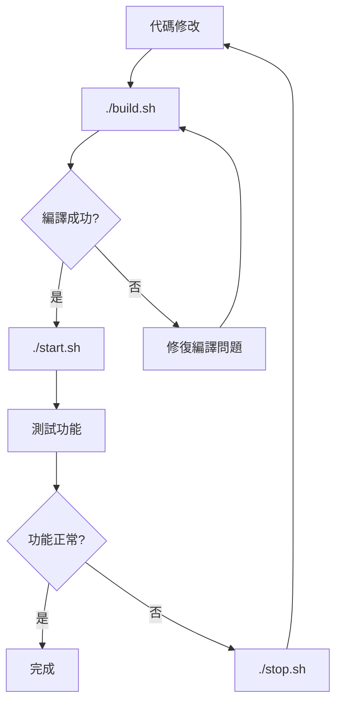

# Care Voice 開發工作流程 SOP

> 標準作業程序 - Standard Operating Procedures

## 📋 概述

本文檔定義了 Care Voice 專案的標準開發工作流程，確保代碼品質、部署一致性和開發效率。

## 🏗️ 核心原則

### 單一職責原則
每個腳本只負責一個明確功能：
- `build.sh` - 只負責編譯
- `start.sh` - 只負責啟動
- `stop.sh` - 只負責關閉

### 編譯與運行分離
- 編譯過程與服務運行完全分離
- 啟動前檢查編譯狀態
- 避免不必要的重複編譯

## 🛠️ 腳本說明

### 1. `build.sh` - 統一編譯腳本

**職責**：編譯前端 + 構建容器

```bash
#!/bin/bash
# ===================================
# Care Voice 統一編譯腳本
# 職責：編譯前端 + 構建容器
# ===================================

# 編譯前端 (SolidJS + Vite)
# 重新構建容器 (前端 + 後端)
# 輸出編譯狀態和產出信息
```

**使用時機**：
- 代碼有任何修改時
- 初次部署時
- 依賴更新後

**執行內容**：
- 前端依賴安裝 (`npm ci`)
- 前端編譯 (`npm run build`)
- 容器重新構建 (`podman build`)
- 編譯狀態驗證

### 2. `start.sh` - 純粹啟動服務

**職責**：啟動 Care Voice 服務

```bash
#!/bin/bash
# ===================================
# Care Voice 業界領先統一啟動腳本
# 職責：純粹啟動服務，不編譯
# ===================================

# 檢查編譯狀態
# 啟動後端容器
# 啟動前端容器
# 顯示服務狀態
```

**使用時機**：
- 服務重啟
- 開發環境啟動
- 系統重啟後

**安全檢查**：
- 前端編譯產出檢查 (`frontend/dist/index.html`)
- 容器鏡像存在檢查 (`care-voice-build-env:latest`)
- 編譯狀態驗證

### 3. `stop.sh` - 純粹關閉服務

**職責**：關閉所有 Care Voice 相關服務

**使用時機**：
- 服務維護
- 系統關閉前
- 故障排除

## 🔄 標準工作流程

### 開發流程



### 日常維護流程

```bash
# 1. 停止服務
./stop.sh

# 2. 修改代碼
# ... 進行開發工作 ...

# 3. 重新編譯
./build.sh

# 4. 啟動服務
./start.sh

# 5. 驗證功能
curl http://localhost:3000/health
```

### 快速重啟流程

```bash
# 無需重新編譯的重啟
./stop.sh && ./start.sh
```

## 🎯 服務架構

### 端口配置
- `3000` - 前端服務 (nginx)
- `8081` - 後端服務 (Rust + Whisper AI)

### 容器架構
- `care-voice-unified` - 前端容器 (nginx)
- `care-voice-backend` - 後端容器 (Rust AI 服務)

### 網路架構
```
用戶 → localhost:3000 (nginx) → localhost:8081 (Rust 後端)
```

## 📊 服務管理

### 狀態檢查
```bash
# 檢查容器狀態
podman ps | grep care-voice

# 檢查服務日誌
podman logs -f care-voice-unified  # 前端日誌
podman logs -f care-voice-backend  # 後端日誌
```

### 健康檢查
```bash
# 前端健康檢查
curl http://localhost:3000

# 後端健康檢查  
curl http://localhost:3000/health

# API 端點測試
curl -X POST http://localhost:3000/upload
```

## 🚨 故障排除

### 常見問題

1. **編譯失敗**
   ```bash
   # 檢查依賴
   cd frontend && npm audit
   
   # 清理重新安裝
   rm -rf node_modules package-lock.json
   npm install
   ```

2. **容器啟動失敗**
   ```bash
   # 檢查容器日誌
   podman logs care-voice-backend
   
   # 檢查鏡像是否存在
   podman images | grep care-voice
   ```

3. **端口衝突**
   ```bash
   # 檢查端口佔用
   ss -lntp | grep -E "3000|8081"
   
   # 強制停止服務
   ./stop.sh
   ```

### 調試模式

```bash
# 啟用詳細日誌
RUST_LOG=debug ./start.sh

# 查看實時日誌
podman logs -f care-voice-backend
```

## 📈 性能監控

### 資源使用
```bash
# 容器資源使用情況
podman stats care-voice-backend care-voice-unified

# 系統資源監控
htop
nvidia-smi  # GPU 使用情況
```

### 音頻處理監控
- 音頻解碼延遲 < 100ms
- GPU 記憶體使用率 < 80%
- 轉錄準確度 > 95%

## 🔧 開發最佳實踐

### 代碼修改流程
1. 修改代碼
2. 執行 `./build.sh` 編譯
3. 執行 `./start.sh` 啟動
4. 測試功能
5. 提交代碼

### 部署檢查清單
- [ ] 前端編譯無錯誤
- [ ] 後端編譯無錯誤  
- [ ] 容器啟動成功
- [ ] 健康檢查通過
- [ ] API 端點可用
- [ ] 音頻功能正常

## 📝 版本管理

### Git 工作流程
```bash
# 修改代碼後
git add .
git commit -m "feat: 實現新功能"

# 編譯和部署
./build.sh
./start.sh

# 驗證後推送
git push origin feature/new-feature
```

## 🎯 品質保證

### 自動化檢查
- 編譯時語法檢查
- 容器健康檢查  
- API 端點驗證
- 音頻功能測試

### 手動驗證
- WebCodecs 錄音測試
- 多瀏覽器相容性
- 音質檢查
- 轉錄準確度

---

## 📞 聯絡與支援

### 快速指令參考
```bash
./build.sh    # 編譯所有組件
./start.sh    # 啟動服務
./stop.sh     # 停止服務
```

### 緊急處理
遇到問題時：
1. 檢查服務狀態
2. 查看容器日誌
3. 執行健康檢查
4. 重新啟動服務
5. 如問題持續，重新編譯

---

**Care Voice SOP - 確保每次部署都是成功的部署！** 🚀