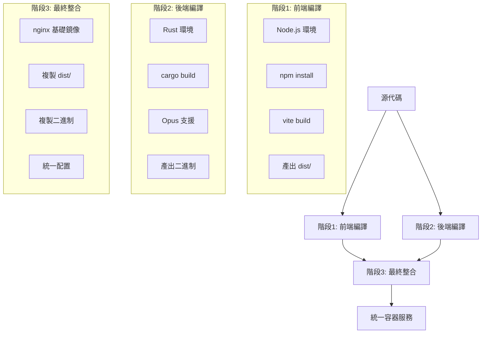

# 🏗️ Care Voice 分階段整合架構設計

**設計版本**: v1.0  
**創建日期**: 2025-07-26  
**分支**: feature/integrated-architecture  
**目標**: 建立三階段構建的整合部署架構  

---

## 📊 整合架構總覽

### **三階段構建流程**



### **架構圖 (ASCII)**

```
用戶請求 :8000
    ↓
┌─────────────────────────────────────┐
│         統一容器                    │
│  ┌─────────────────────────────────┐│
│  │            nginx                ││ 
│  │  ┌─────────────┬─────────────┐  ││
│  │  │ 靜態文件    │ API 代理     │  ││
│  │  │ /          │ /api        │  ││
│  │  │ ↓          │ ↓           │  ││
│  │  │ frontend   │ backend     │  ││
│  │  │ (dist/)    │ (rust)      │  ││
│  │  └─────────────┴─────────────┘  ││
│  └─────────────────────────────────┘│
└─────────────────────────────────────┘
```

---

## 🔧 分階段實施詳細設計

### **階段1: 前端編譯容器**

#### **目標**
- 編譯 SolidJS + Vite 前端應用
- 產出可部署的 `dist/` 目錄
- 優化靜態資源

#### **Dockerfile 設計** (`frontend/Dockerfile.build`)
```dockerfile
# =======================================================
# Care Voice 前端編譯階段
# 目標: SolidJS + Vite 編譯產出 dist/
# =======================================================
FROM node:20-slim AS frontend-builder

LABEL stage="frontend-build"
LABEL version="1.0.0"

WORKDIR /app

# 優化依賴安裝 (利用 Docker 快取層)
COPY package.json package-lock.json ./
RUN npm ci --only=production

# 複製源代碼
COPY . .

# 編譯前端
RUN npm run build

# 驗證編譯產出
RUN ls -la dist/ && \
    echo "✅ 前端編譯完成，產出大小:" && \
    du -sh dist/

# 標記編譯完成
RUN echo "frontend-build-complete" > /app/build-status
```

#### **產出檔案結構**
```
/app/dist/
├── index.html
├── assets/
│   ├── index-[hash].js
│   ├── index-[hash].css
│   └── [其他資源]
└── [靜態文件]
```

### **階段2: 後端編譯容器**

#### **目標**
- 編譯 Rust + whisper-rs 後端服務
- 包含完整 Opus 支援
- 產出可執行二進制文件

#### **Dockerfile 設計** (`backend/Dockerfile.build`)
```dockerfile
# =======================================================
# Care Voice 後端編譯階段  
# 目標: Rust + Opus 支援編譯
# =======================================================
FROM rust:1.75-slim AS backend-builder

LABEL stage="backend-build"
LABEL version="1.0.0"

# 安裝系統依賴
RUN apt-get update && apt-get install -y \
    pkg-config \
    libssl-dev \
    libopus-dev \
    cmake \
    build-essential \
    curl \
    && rm -rf /var/lib/apt/lists/*

WORKDIR /app

# 優化 Rust 編譯 (依賴快取)
COPY Cargo.toml Cargo.lock ./
RUN mkdir src && echo "fn main() {}" > src/main.rs
RUN cargo build --release
RUN rm -rf src/

# 複製實際源代碼
COPY src/ ./src/

# 重新編譯 (僅應用代碼)
RUN touch src/main.rs && \
    cargo build --release --features opus-support

# 驗證編譯產出
RUN ls -la target/release/ && \
    ldd target/release/care-voice || echo "靜態連結" && \
    echo "✅ 後端編譯完成，二進制大小:" && \
    du -sh target/release/care-voice

# 標記編譯完成
RUN echo "backend-build-complete" > /app/build-status
```

#### **產出檔案**
```
/app/target/release/care-voice    # 主要二進制文件
```

### **階段3: 最終整合容器**

#### **目標**
- 整合前端 `dist/` 和後端二進制
- 配置統一 nginx 服務
- 設定多進程管理 (supervisord)

#### **Dockerfile 設計** (`Dockerfile.final`)
```dockerfile
# =======================================================
# Care Voice 最終整合階段
# 目標: nginx + 前端 + 後端統一服務
# =======================================================
FROM nginx:alpine

LABEL stage="final-integration"
LABEL version="1.0.0"
LABEL description="Care Voice unified service with frontend + backend + nginx"

# 安裝 supervisor 用於多進程管理
RUN apk add --no-cache \
    supervisor \
    curl \
    bash

# 創建必要目錄
RUN mkdir -p /var/log/supervisor \
    /app \
    /etc/supervisor/conf.d

# 從前端編譯階段複製靜態文件
COPY --from=care-voice-frontend:latest /app/dist/ /usr/share/nginx/html/

# 從後端編譯階段複製二進制文件
COPY --from=care-voice-backend:latest /app/target/release/care-voice /app/

# 複製統一 nginx 配置
COPY nginx-integrated.conf /etc/nginx/nginx.conf

# 複製 supervisor 配置
COPY supervisord-integrated.conf /etc/supervisor/conf.d/supervisord.conf

# 設定執行權限
RUN chmod +x /app/care-voice

# 健康檢查
HEALTHCHECK --interval=30s --timeout=10s --start-period=40s --retries=3 \
    CMD curl -f http://localhost:8000/health || exit 1

# 暴露端口
EXPOSE 8000

# 啟動 supervisor (管理 nginx + backend)
CMD ["/usr/bin/supervisord", "-c", "/etc/supervisor/conf.d/supervisord.conf"]
```

---

## 🌐 統一 nginx 配置設計

### **nginx-integrated.conf**
```nginx
# =======================================================
# Care Voice 統一 nginx 配置
# 管理: 前端靜態文件 + 後端 API 代理
# =======================================================

events {
    worker_connections 1024;
}

http {
    include /etc/nginx/mime.types;
    default_type application/octet-stream;
    
    # 日誌配置
    access_log /var/log/nginx/access.log;
    error_log /var/log/nginx/error.log warn;
    
    # 性能優化
    sendfile on;
    tcp_nopush on;
    tcp_nodelay on;
    keepalive_timeout 65;
    
    # Gzip 壓縮
    gzip on;
    gzip_vary on;
    gzip_min_length 1024;
    gzip_proxied any;
    gzip_comp_level 6;
    gzip_types
        text/plain
        text/css
        text/xml
        text/javascript
        application/json
        application/javascript
        application/xml+rss
        application/atom+xml
        image/svg+xml;

    server {
        listen 8000;
        server_name localhost;
        root /usr/share/nginx/html;
        index index.html;
        
        # API 代理到後端服務
        location /api/ {
            # 移除 /api 前綴，直接代理到後端
            rewrite ^/api/(.*)$ /$1 break;
            proxy_pass http://localhost:8001;
            
            # 代理標頭設定
            proxy_set_header Host $host;
            proxy_set_header X-Real-IP $remote_addr;
            proxy_set_header X-Forwarded-For $proxy_add_x_forwarded_for;
            proxy_set_header X-Forwarded-Proto $scheme;
            
            # 文件上傳支援 (音頻文件)
            client_max_body_size 100M;
            proxy_connect_timeout 60s;
            proxy_send_timeout 120s;
            proxy_read_timeout 120s;
            
            # 緩衝設定 (大文件處理)
            proxy_buffering off;
            proxy_request_buffering off;
        }
        
        # 健康檢查直接代理
        location /health {
            proxy_pass http://localhost:8001/health;
            proxy_set_header Host $host;
            access_log off;
        }
        
        # 靜態資源優化快取
        location ~* \.(js|css|png|jpg|jpeg|gif|ico|svg|woff|woff2|ttf|eot)$ {
            expires 1y;
            add_header Cache-Control "public, immutable";
            add_header X-Served-By "nginx-integrated";
            
            # 開啟 gzip
            gzip_static on;
        }
        
        # SPA 路由支援 - 所有其他請求返回 index.html
        location / {
            try_files $uri $uri/ /index.html;
            
            # HTML 文件不快取
            location ~* \.html$ {
                add_header Cache-Control "no-cache, no-store, must-revalidate";
                add_header Pragma "no-cache";
                add_header Expires "0";
                add_header X-Served-By "nginx-integrated";
            }
        }
        
        # 安全配置
        add_header X-Frame-Options "SAMEORIGIN" always;
        add_header X-Content-Type-Options "nosniff" always;
        add_header X-XSS-Protection "1; mode=block" always;
        add_header Referrer-Policy "no-referrer-when-downgrade" always;
        
        # CSP 安全策略 (允許音頻錄製)
        add_header Content-Security-Policy "default-src 'self'; script-src 'self' 'unsafe-inline'; style-src 'self' 'unsafe-inline'; media-src 'self' blob:; connect-src 'self'" always;
    }
}
```

---

## 🔧 Supervisor 多進程管理

### **supervisord-integrated.conf**
```ini
[supervisord]
nodaemon=true
logfile=/var/log/supervisor/supervisord.log
pidfile=/var/run/supervisord.pid
childlogdir=/var/log/supervisor

[program:nginx]
command=nginx -g "daemon off;"
priority=100
autostart=true
autorestart=true
stdout_logfile=/var/log/supervisor/nginx.log
stderr_logfile=/var/log/supervisor/nginx_error.log

[program:care-voice-backend]
command=/app/care-voice
directory=/app
priority=200
autostart=true
autorestart=true
environment=RUST_LOG=info,PORT=8001
stdout_logfile=/var/log/supervisor/backend.log
stderr_logfile=/var/log/supervisor/backend_error.log

[unix_http_server]
file=/var/run/supervisor.sock

[supervisorctl]
serverurl=unix:///var/run/supervisor.sock

[rpcinterface:supervisor]
supervisor.rpcinterface_factory = supervisor.rpcinterface:make_main_rpcinterface
```

---

## 🚀 Podman Compose 整合配置

### **podman-compose.integrated.yml**
```yaml
version: '3.8'

services:
  # 前端編譯服務
  frontend-builder:
    build:
      context: ./frontend
      dockerfile: Dockerfile.build
    image: care-voice-frontend:latest
    container_name: care-voice-frontend-builder
    volumes:
      - frontend-dist:/app/dist

  # 後端編譯服務  
  backend-builder:
    build:
      context: ./backend
      dockerfile: Dockerfile.build
    image: care-voice-backend:latest
    container_name: care-voice-backend-builder
    volumes:
      - backend-bin:/app/target/release

  # 最終整合服務
  care-voice-integrated:
    build:
      context: .
      dockerfile: Dockerfile.final
    image: care-voice-integrated:latest
    container_name: care-voice-integrated
    ports:
      - "8000:8000"
    depends_on:
      - frontend-builder
      - backend-builder
    restart: unless-stopped
    environment:
      - RUST_LOG=info
    healthcheck:
      test: ["CMD", "curl", "-f", "http://localhost:8000/health"]
      interval: 30s
      timeout: 10s
      retries: 3
      start_period: 40s
    volumes:
      - care-voice-logs:/var/log/supervisor
    networks:
      - care-voice-net

volumes:
  frontend-dist:
    driver: local
  backend-bin:
    driver: local
  care-voice-logs:
    driver: local

networks:
  care-voice-net:
    driver: bridge
```

---

## 📋 構建依賴關係

### **構建順序**
```
1. frontend-builder  → care-voice-frontend:latest
2. backend-builder   → care-voice-backend:latest  
3. final-integration → care-voice-integrated:latest
```

### **數據流**
```
源代碼
  ├── frontend/ → [編譯] → dist/ → [複製] → 最終容器
  └── backend/  → [編譯] → 二進制 → [複製] → 最終容器
```

---

## 🎯 預期使用方式

### **一鍵構建啟動**
```bash
# 構建並啟動整個系統
podman-compose -f podman-compose.integrated.yml up --build

# 後台運行
podman-compose -f podman-compose.integrated.yml up -d --build
```

### **分步驟構建** (調試用)
```bash
# 僅構建前端
podman-compose -f podman-compose.integrated.yml build frontend-builder

# 僅構建後端
podman-compose -f podman-compose.integrated.yml build backend-builder

# 構建最終整合
podman-compose -f podman-compose.integrated.yml build care-voice-integrated
```

### **服務訪問**
```bash
# 前端應用
curl http://localhost:8000/

# 後端 API  
curl http://localhost:8000/api/health

# 健康檢查
curl http://localhost:8000/health
```

---

## 🔍 優勢與特點

### **分階段構建優勢**
- ✅ **快取優化**: 前後端獨立編譯，變更時僅重建必要部分
- ✅ **並行構建**: frontend 和 backend 可同時編譯
- ✅ **故障隔離**: 前端編譯失敗不影響後端，反之亦然
- ✅ **版本控制**: 每個階段可獨立版本化

### **整合部署優勢**  
- ✅ **統一入口**: 一個端口 (8000) 處理所有請求
- ✅ **簡化運維**: 單一容器管理，無需網路配置
- ✅ **性能優化**: nginx 直接服務靜態文件，無額外網路開銷
- ✅ **資源共享**: 前後端共享容器資源

### **開發體驗優勢**
- ✅ **一鍵啟動**: `podman-compose up --build` 搞定一切
- ✅ **清晰分工**: 前端、後端、整合各司其職
- ✅ **易於調試**: 每個階段可獨立測試
- ✅ **擴展友善**: 新增服務只需增加新的構建階段

---

**🎉 總結**: 此分階段整合架構既保持了開發的靈活性，又實現了部署的統一性，是複雜應用容器化的最佳實踐方案。