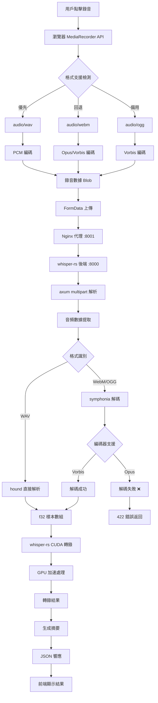
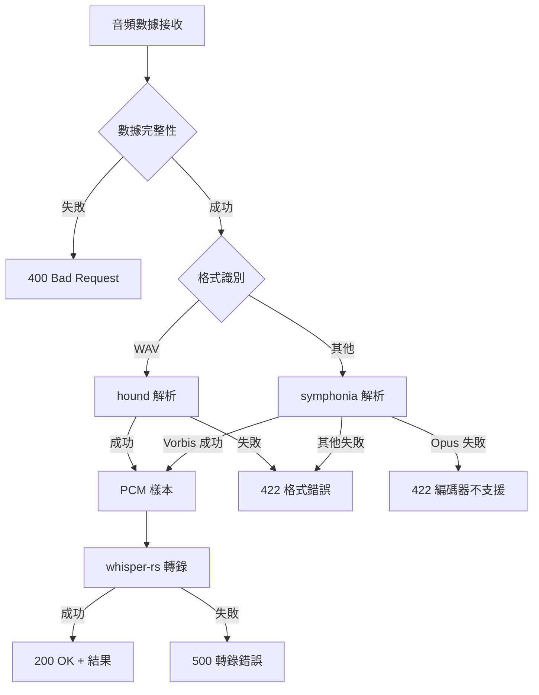

# 🏗️ Care Voice 音頻處理架構設計

## 📋 架構概要

**系統名稱**: Care Voice whisper-rs 音頻處理系統  
**版本**: 2.0.0 (CUDA 12.9.1)  
**建立日期**: 2025-07-26  
**架構類型**: 前後端分離 + GPU 加速語音轉錄

---

## 🔄 完整音頻處理流程圖



---

## 🧩 系統組件架構

### 前端組件 (Solid.js)

#### 1. 音頻錄製模組 (`frontend/src/App.tsx`)
```typescript
interface AudioRecordingModule {
  // 核心功能
  startRecording(): Promise<void>
  stopRecording(): void
  uploadAudio(): Promise<TranscriptResponse>
  
  // 狀態管理
  isRecording: Signal<boolean>
  audioBlob: Signal<Blob | null>
  isUploading: Signal<boolean>
  
  // 格式支援
  getSupportedFormats(): string[]
  selectOptimalFormat(): MediaRecorderOptions
}
```

#### 2. 格式選擇策略
```typescript
// 優先級排序 (frontend/src/App.tsx:32-57)
const formatPriority = [
  'audio/wav',      // 優先 (直接支援)
  'audio/webm',     // Chrome (需轉換)
  'audio/ogg'       // Firefox (需轉換)
];
```

### 後端組件 (Rust + whisper-rs)

#### 1. HTTP 服務層 (`backend/src/main.rs:155-200`)
```rust
// API 端點
POST /api/upload          // 音頻上傳和轉錄
GET  /health             // 健康檢查
GET  /models             // 模型信息 (未實現)

// 中間件
- CORS 支援
- multipart 文件處理
- 錯誤處理和日誌
```

#### 2. 音頻轉換層 (`backend/src/main.rs:208-400`)
```rust
pub struct AudioProcessor {
    // 格式支援
    wav_decoder: hound::WavReader,
    symphonia_decoder: SymphoniaDecoder,
    
    // 轉換流程
    fn convert_to_wav_samples(&[u8]) -> Result<Vec<f32>>
    fn try_read_as_wav(&[u8]) -> Result<Vec<f32>>
    fn try_decode_with_symphonia(&[u8]) -> Result<Vec<f32>>
}
```

#### 3. 語音識別層 (whisper-rs)
```rust
pub struct WhisperService {
    context: WhisperContext,
    
    // 核心功能
    fn transcribe(&[f32]) -> Result<String>
    fn new(model_path: &str) -> Result<Self>
}
```

---

## 📊 數據流架構

### 1. 音頻數據格式轉換鏈

```
瀏覽器音頻 → Blob → Bytes → 解碼 → f32[] → Whisper → 文字
    ↓           ↓      ↓      ↓      ↓       ↓
WebM/WAV    FormData  Vec<u8>  PCM   GPU    String
```

#### 詳細轉換步驟:
1. **MediaRecorder** → `Blob` (瀏覽器音頻格式)
2. **FormData** → `Vec<u8>` (HTTP multipart 傳輸)
3. **格式探測** → `hound` 或 `symphonia` (解碼器選擇)
4. **解碼** → `Vec<f32>` (PCM 樣本數據)
5. **whisper-rs** → `String` (CUDA GPU 轉錄)

### 2. 錯誤處理流程



---

## ⚙️ 技術堆棧架構

### 前端技術棧
```
├── Solid.js 1.9.0        # 響應式前端框架
├── TypeScript             # 類型安全
├── Vite 6.0.0            # 建構工具
├── CSS3                  # 樣式設計
└── MediaRecorder API     # 音頻錄製
```

### 後端技術棧
```
├── Rust 1.88+            # 系統程式語言
├── axum 0.8              # HTTP 服務框架
├── whisper-rs 0.14.3     # 語音識別 (CUDA)
├── symphonia 0.5         # 音頻格式解碼
├── hound 3.5             # WAV 文件處理
└── tokio 1.0             # 非同步運行時
```

### 系統基礎架構
```
├── CUDA 12.9.1           # GPU 加速計算
├── Ubuntu 24.04 LTS      # 操作系統
├── Podman 容器           # 容器化部署
├── Nginx 1.24.0          # 反向代理
└── Supervisord           # 進程管理
```

---

## 🔧 容器化架構

### 多階段建構設計 (`Dockerfile.whisper-rs-gpu`)

```dockerfile
# 階段 1: 前端建構
FROM node:20-slim AS frontend-builder
WORKDIR /app/frontend
COPY frontend/ ./
RUN npm ci && npm run build

# 階段 2: Rust 編譯
FROM nvidia/cuda:12.9.1-devel-ubuntu24.04 AS rust-builder
# ... CUDA 環境配置
COPY backend/ ./
RUN cargo build --release --features gpu

# 階段 3: 運行時環境
FROM nvidia/cuda:12.9.1-runtime-ubuntu24.04 AS runtime
# ... 服務配置
COPY --from=frontend-builder /app/frontend/dist /usr/share/nginx/html
COPY --from=rust-builder /app/target/release/care-voice /app/care-voice
```

### 服務編排架構 (`supervisord_whisper_rs.conf`)

```ini
[program:whisper-rs]     # 優先級 100 (核心服務)
[program:nginx]          # 優先級 200 (代理服務)
[program:gpu-monitor]    # 優先級 300 (監控服務)
```

---

## 🚀 性能架構設計

### GPU 加速架構
```
CPU 端                    GPU 端 (RTX 5070 Ti)
├── 音頻預處理             ├── CUDA 運算核心
├── 格式轉換              ├── Tensor 操作
├── 數據準備              ├── Whisper 模型推理
└── 結果後處理             └── 記憶體管理 (16GB VRAM)
```

### 記憶體管理架構
- **系統記憶體**: ~3GB (容器運行)
- **GPU 記憶體**: ~147MB (Whisper base 模型)
- **音頻緩存**: 動態分配 (基於錄音長度)

### 並發處理架構
```rust
// tokio 非同步處理
async fn upload_audio() -> Result<TranscriptResponse> {
    let audio_data = multipart.next_field().await?;  // 非阻塞 I/O
    let samples = convert_audio(audio_data)?;        // CPU 轉換
    let result = whisper_service.transcribe(samples).await?; // GPU 處理
    Ok(result)
}
```

---

## 🔒 安全架構設計

### 數據安全
- **傳輸**: HTTPS 加密 (生產環境)
- **存儲**: 臨時音頻數據，處理後立即清除
- **訪問**: CORS 政策控制

### 容器安全
- **用戶**: 非 root 用戶運行 (app:1000)
- **權限**: 最小權限原則
- **隔離**: 容器網路隔離

---

## 📈 監控和可觀察性架構

### 日誌架構
```
├── whisper-rs 服務日誌   → /var/log/supervisor/whisper-rs.log
├── nginx 訪問日誌        → /var/log/nginx/access.log
├── GPU 監控日誌         → /var/log/supervisor/gpu-monitor.log
└── 系統監控日誌         → /var/log/supervisor/supervisord.log
```

### 健康檢查架構
```
GET /health → {
  "service": "Care Voice with whisper-rs",
  "status": "healthy",
  "version": "1.0.0"
}
```

### GPU 監控架構
```python
# gpu_diagnostics_whisper_rs.py
class WhisperRsGPUDiagnostics:
    def check_gpu_status()      # nvidia-smi 狀態
    def check_whisper_process() # 進程監控
    def check_health_endpoint() # 服務可用性
```

---

## 🔮 架構演進規劃

### 短期改進 (1-2週)
1. **音頻格式支援** → 添加 Opus 編解碼器
2. **錯誤處理** → 改進格式轉換失敗處理
3. **監控增強** → 添加轉換成功率指標

### 中期優化 (1-2月)
1. **FFmpeg 整合** → 備用音頻轉換方案
2. **批量處理** → 支援多文件並行轉錄
3. **緩存機制** → 模型預載入優化

### 長期規劃 (3-6月)
1. **分散式部署** → 多 GPU 節點支援
2. **即時轉錄** → WebSocket 串流處理
3. **模型升級** → Whisper large-v3 支援

---

*本架構文檔建立於 2025-07-26，記錄 Care Voice whisper-rs 專案的完整音頻處理架構設計*